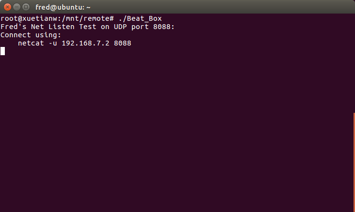
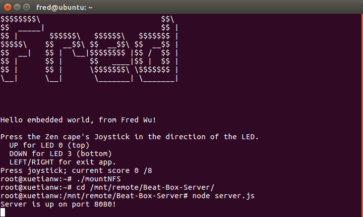
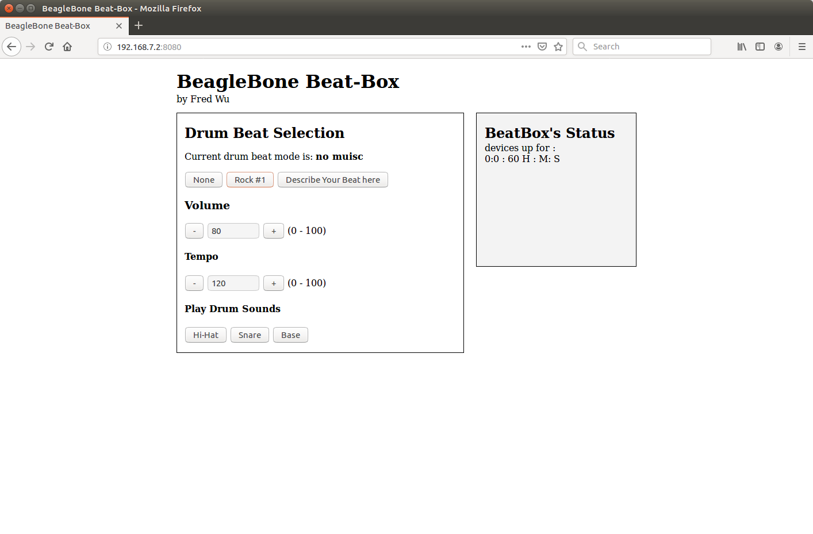
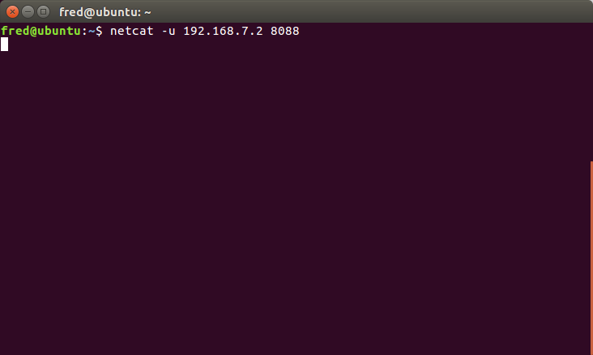

# BeagleBone-Beat-Box-Application
  
  
on the targer run Beat_Box to start the program

runs node.js server on the target to talk to the UDP Interface

****web interface****

**user connects to the socket netcat -u 192.168.7.2 8088**

